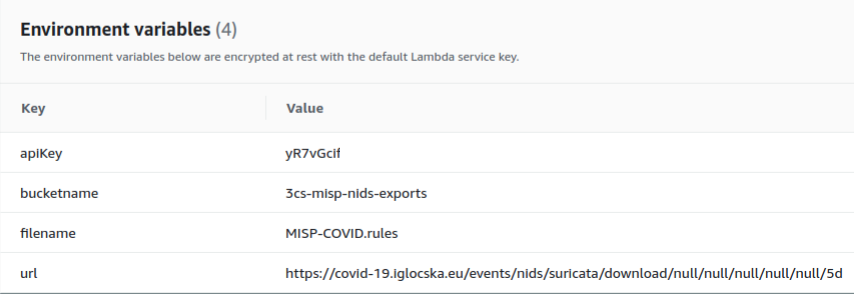

# AWS Lambda MISP NIDS IOC Exporter
Export NIDS IOC's from a MISP instance

# Install

- Create an S3 bucket to save the NIDS rules
- Create a Lambda [execution role](./iam-role.json)
- [Deploy](./imgs/upload.png) the [deployment package](./deployment-package.zip) in a Node 12 environment
- Create a CloudWatch Event Rule as [per the image](./imgs/cwe-rule.png)

The function requires 4 variables to be set:

- apiKey *(you get this from your MISP instance)*
- bucketName *(where the file will be stored)*
- fileName *(file name to save the rules in - goes into the bucket)*
- url *(check NIDS rules export [here](https://www.circl.lu/doc/misp/automation/#events-management) - Example: https://yourmisp.com/events/nids/suricata/download/null/null/null/null/null/5d)*

Example configuration:

